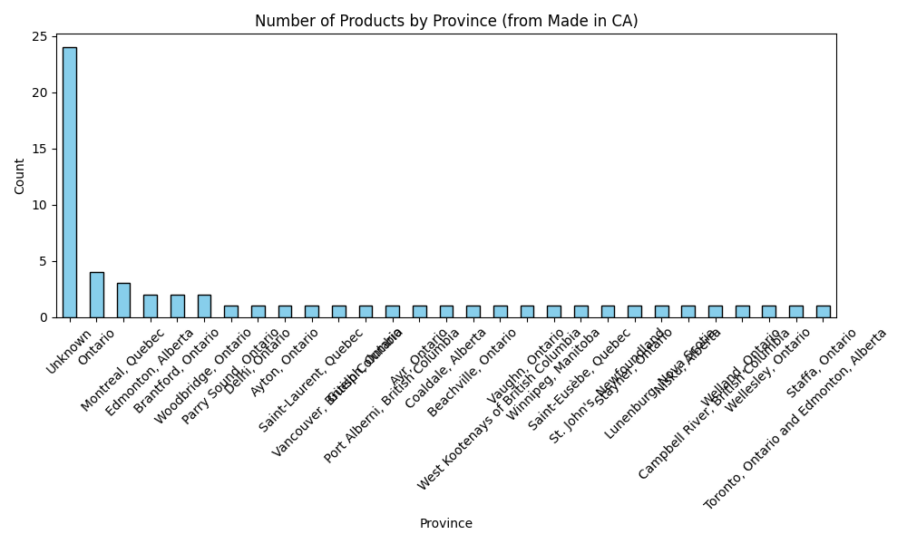
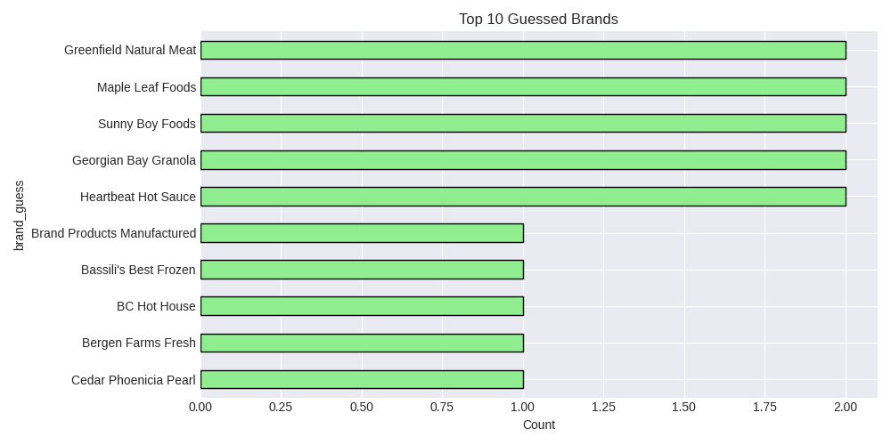

# CFDB Prototype - Real Data Pipeline

##  Project Overview
This prototype demonstrates an end-to-end data pipeline for **Canada's Closed Food Database (CFDB)**.  
It scrapes real product data from Canadian sources, cleans and transforms it using Medallion Architecture (Bronze → Silver → Gold), and performs exploratory data analysis with visualizations.

##  Objectives
- Scrape real data from `madeinca.ca/grocery-store-guide/` (60 Canadian products).
- Build a reusable pipeline (Bronze: raw JSON, Silver: cleaned CSV, Gold: aggregated metrics).
- Visualize product distribution by province and top brands.

##  Tech Stack
- **Python** (Requests, BeautifulSoup, Pandas, DuckDB)
- **Visualization**: Matplotlib, Seaborn, WordCloud
- **Environment**: Jupyter Notebook, VS Code, Git
- **Deployment**: GitHub

##  Pipeline Architecture

| Layer | Description | Output |
|-------|-------------|--------|
| Bronze | Raw scraped data (HTML, JSON) | `data/bronze/raw_scrape.json` |
| Silver | Cleaned, deduplicated data | `data/silver/cleaned_data.csv` |
| Gold | Aggregated metrics & visualizations | `data/gold/*.png`, `aggregated_metrics.csv` |

##  Visual Results

### Products by Province


### Top 10 Brands


### Word Cloud of Product Descriptions


## 🚀 How to Run

1. Clone the repository:
   ```bash
   git clone https://github.com/saranour700/CFDB_prototype.git
   cd CFDB_prototype
